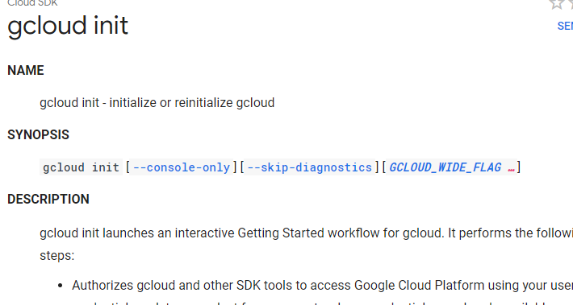

# Honeypot
 /* Decoy application, server, or other networked resource that intentionally exposes insecure features which, when exploited by an attacker, will reveal information about the methods, tools, and possibly even the identity of that attacker. */

I decided to go with the MHN recommended set up to ensure effective resources available to solve any problems that could arise. 

 Milestone 0: To the Cloud!
 
 I set up my GCP. One thing I noticed about GCP is they document their set up process throughly and precisely. I appreciated the clear instructions.
 
 
 
 Milestone 1: Create MHN Admin VM
 
 The next step was to set up MHN admin VM, specifying specific port use and special permissions. I then took note of the IP address as instructed by taking a picture with my phone.
 
 
 
 Milestone 2: Install the MHN Admin Application
 
     $ cd /opt
     $ sudo git clone https://github.com/RedolentSun/mhn.git
     $ cd mhn
     $ sudo ./install.sh
 
 Initially in moving on to the next set of instructions, I started noticing a few warnings/erros. Github was notifying me that I needed to check the permissions allowed. I then received and error specifying exit code 128. I thought maybe the error was regarding the permissions warning. I corrected this error by running the command sudo -H ./install.sh. I continued to receive error 128. I eventually was able to correct this issue with the recently posted discovery of a broken line of code due to deletion of the repo Hurricane Labs. I edited the file install_hpfeeds.sh in nano to show the corrected repo used, Couozo. 
 
 
 

 After this script succesfully was run and processed, I tried to access the MHN admin VM through the browser and was getting a connection error and to check my proxy. I learned I needed to ensure TCP 80 in MHN admin was open. I changed the firewall settings in GCP through VPN network options.

Milestone 4: Install the Honeypot Application
 I then deployed the Ubuntu - Dionaea with HTTP and confirmed the honeypot set up by reviewing sensors listed. 
 
 Milestone 5: Attack!
 
 I set up nmap in whn admin VM and attacked my honeypot. 
 
 Exporting Data
 
 
 
